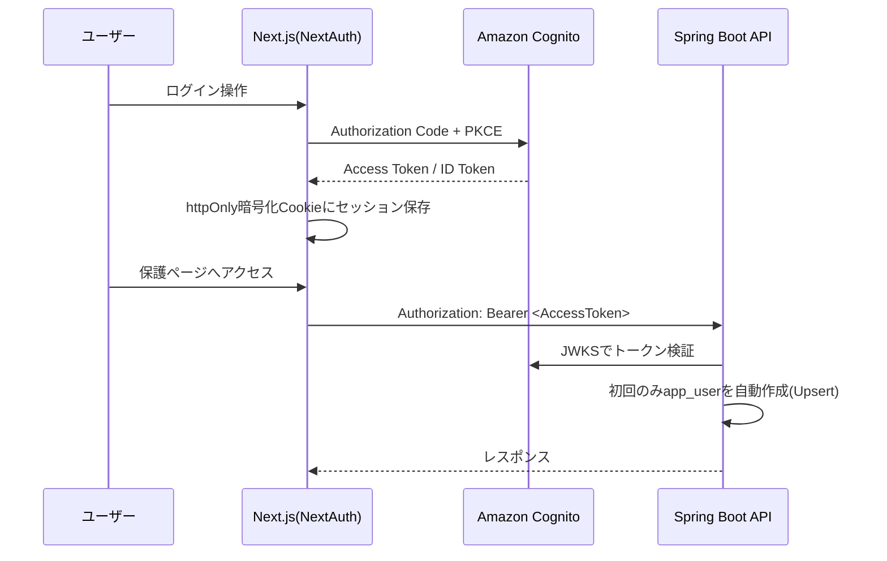

# API一覧

- 文書種別: API一覧・共通仕様
- 対象プロジェクト: IELTS Creator（IELTS練習問題作成アプリ／ポートフォリオ用途）
- 更新日: 2026-08-09
- 関連文書: [システム要件定義書（ielts-createrリポジトリ）8章 アーキテクチャ](https://github.com/h-fujiwara-dev/ielts-creater/blob/main/docs/システム要件定義書.md#8-アーキテクチャ) / [API設計書/](./API設計書/) / [ER図・テーブル定義](./ER図・テーブル定義.md)

## 1. API一覧

全エンドポイントは`Authorization: Bearer <Cognito AccessToken>`必須（`/actuator/health`除く）。

| メソッド | パス | 説明 | 詳細 |
| --- | --- | --- | --- |
| GET | `/api/v1/me` | JWTから自動プロビジョニングしたユーザー情報取得 | [API設計書](./API設計書/GET_me.md) |
| POST | `/api/v1/question-sets` | 問題セット生成を開始（202 Accepted） | [API設計書](./API設計書/POST_question-sets.md) |
| GET | `/api/v1/question-sets/{id}` | 問題セット詳細取得（正解は含めない） | [API設計書](./API設計書/GET_question-sets-id.md) |
| GET | `/api/v1/question-sets/{id}/audio-segments` | Listening用、署名付きURL付きセグメント一覧 | [API設計書](./API設計書/GET_question-sets-id-audio-segments.md) |
| POST | `/api/v1/attempts` | 受験（Attempt）を開始 | [API設計書](./API設計書/POST_attempts.md) |
| PATCH | `/api/v1/attempts/{id}/answers` | 回答の部分保存 | [API設計書](./API設計書/PATCH_attempts-id-answers.md) |
| POST | `/api/v1/attempts/{id}/submit` | 採点実行 | [API設計書](./API設計書/POST_attempts-id-submit.md) |
| GET | `/api/v1/attempts/{id}` | 採点済み結果の詳細 | [API設計書](./API設計書/GET_attempts-id.md) |
| GET | `/api/v1/attempts` | 受験履歴一覧（ページング・絞り込み） | [API設計書](./API設計書/GET_attempts.md) |
| GET | `/api/v1/dashboard/summary` | ダッシュボード集計データ | [API設計書](./API設計書/GET_dashboard-summary.md) |

各画面がどのAPIを呼ぶかは[frontendリポジトリ docs/画面一覧.md](https://github.com/h-fujiwara-dev/ielts-creater-frontend/blob/main/docs/画面一覧.md)を参照。

## 2. 共通仕様

- ベースパス: `/api/v1`
- 認証: `Authorization: Bearer <Cognito AccessToken>`（`/actuator/health`を除く）
- エラーレスポンス形式:

```json
{
  "error": "VALIDATION_ERROR",
  "message": "difficulty must be one of BAND_4_5, BAND_5_6, BAND_6_7, BAND_7_8_PLUS",
  "timestamp": "2026-08-08T10:00:00Z"
}
```

### 2.1 例外とHTTPステータスの対応

| 例外 | HTTPステータス | 発生条件 |
| --- | --- | --- |
| `ResourceNotFoundException` | 404 | 指定IDの問題セット/受験が存在しない、または他ユーザーのものである |
| `ValidationException` | 400 | リクエストパラメータ不正（不正なsection/difficulty等） |
| `GenerationFailedException` | 422 | AI生成がリトライ上限に達し失敗 |
| `UnauthorizedException` | 401 | JWT検証失敗・期限切れ |
| その他未捕捉例外 | 500 | `GlobalExceptionHandler`（`@RestControllerAdvice`）で共通エラーレスポンスに変換 |

## 3. 認証フロー



- CognitoのアクセストークンはOIDC標準の`aud`クレームを持たないため、バックエンドでは`token_use=access`と`client_id`の検証を独自実装で追加する
- Cognito App Client（confidential）はTerraform（[infraリポジトリ](https://github.com/h-fujiwara-dev/ielts-creater-infra)）で構築する
- フロントエンド（NextAuth.js側）の実装方針は[frontendリポジトリ docs/画面設計書/S-02_ログインサインアップ画面.md](https://github.com/h-fujiwara-dev/ielts-creater-frontend/blob/main/docs/画面設計書/S-02_ログインサインアップ画面.md)を参照

## 4. ロギング方針

- フォーマット: 構造化ログ（JSON）、CloudWatch Logsへ出力
- 必須フィールド: `timestamp`, `level`, `traceId`, `userId`（取得できる場合）, `message`
- 記録対象:
  - OpenAI/Polly呼び出しの開始・終了・所要時間・失敗理由（プロンプト全文はコスト・機密性の観点から本文はDEBUGレベルのみ）
  - 生成バリデーション失敗時のリトライ回数・最終結果
  - 採点処理のスコア確定ログ
  - 認証エラー（401/403）発生時のリクエストパス
- APIキー・トークン等の機密情報はログに出力しない

## 付録: 実装構成（パッケージ・クラス設計）

### パッケージ構成

```text
com.ieltscreator.api
├── config/            # Bean定義（Security, Cors, OpenAiClient, PollyClient, S3Client, Async）
├── domain/             # JPAエンティティ
├── repository/         # Spring Data JPAリポジトリ
├── service/
│   ├── generation/     # OpenAI呼び出し・プロンプト構築・生成結果バリデーション
│   ├── listening/       # Polly音声合成・StorageService
│   ├── grading/          # 採点ストラテジー群
│   └── dashboard/       # 集計クエリ
├── web/                  # Controller・DTO
└── security/             # Cognito JWT検証カスタマイズ
```

### 主要クラスと責務

| クラス | 種別 | 責務 |
| --- | --- | --- |
| `QuestionSetController` | Controller | 問題セットの生成開始・詳細取得・音声セグメント取得のエンドポイントを提供 |
| `AttemptController` | Controller | 受験の開始・回答保存・提出・結果取得・履歴一覧のエンドポイントを提供 |
| `DashboardController` | Controller | ダッシュボード集計データ取得のエンドポイントを提供 |
| `MeController` | Controller | ログインユーザー情報取得のエンドポイントを提供 |
| `QuestionSetGenerationService` | Service | セクションに応じてReading/Listening生成サービスへ振り分け、`question_set`のステータス管理を行う |
| `ReadingQuestionGenerator` | Service | OpenAI APIへReadingパッセージ・設問生成を依頼し、レスポンスを永続化する |
| `ListeningQuestionGenerator` | Service | OpenAI APIへ台本・設問生成を依頼し、`ListeningAudioSynthesizer`と連携する |
| `ListeningAudioSynthesizer` | Service | 台本の発話ごとにPollyで音声合成し、`StorageService`経由で保存する |
| `StorageService`（interface） | Service | 音声ファイルの保存・URL発行を抽象化 |
| `LocalDiskStorageService` | Service実装 | Phase1用。ローカルディスクに保存 |
| `S3StorageService` | Service実装 | Phase3以降。S3に保存し署名付きURLを発行 |
| `AnswerGrader`（interface） | Service | 1設問に対する正誤判定を行う |
| `TfngGrader` / `McqGrader` / `FillBlankGrader` / `MatchingHeadingsGrader` | Service実装 | 出題形式ごとの採点ロジック |
| `GraderFactory` | Service | `format_type`に応じて適切な`AnswerGrader`を解決する |
| `AttemptSubmissionService` | Service | 提出時に全設問をGraderへ委譲し、スコアを集計・永続化する |
| `UserProvisioningService` | Service | JWTの`sub`/`email`から`app_user`をUpsertする |
| `DashboardSummaryService` | Service | 受験履歴からスコア推移・正答率を集計する |
| `CognitoJwtValidatorConfig` | Config | `NimbusJwtDecoder`にCognito固有のバリデータ（`token_use`, `client_id`）を追加する |
