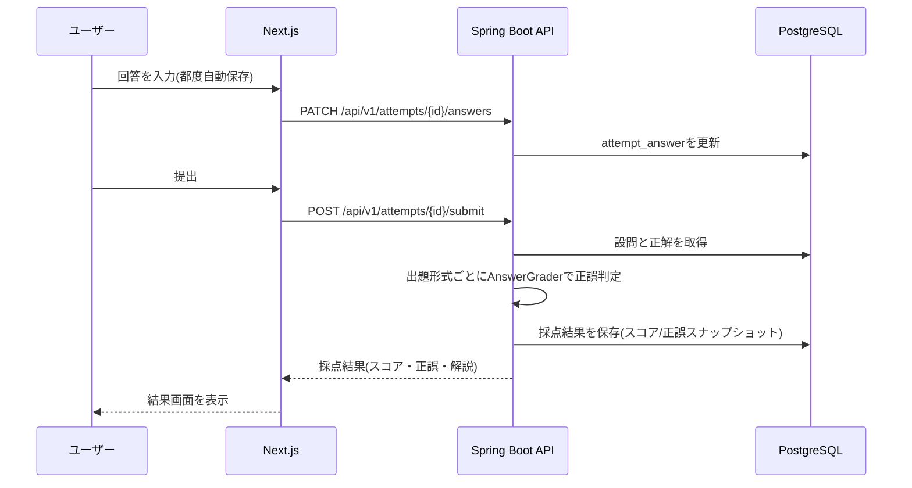

# POST /api/v1/attempts/{id}/submit

- 関連文書: [API一覧](../API一覧.md) / [PATCH_attempts-id-answers.md](./PATCH_attempts-id-answers.md) / [ER図・テーブル定義](../ER図・テーブル定義.md)

採点を実行する。

```json
{
  "attemptId": "att-01",
  "rawScore": 7,
  "maxScore": 10,
  "answers": [
    {
      "questionId": "q1",
      "userAnswerText": "TRUE",
      "isCorrect": true,
      "correctAnswer": "TRUE",
      "explanation": "Paragraph B states that green spaces lower surrounding temperatures."
    }
  ]
}
```

## 採点フロー



## 採点ロジック詳細設計

`AnswerGrader`インタフェース:

```java
public interface AnswerGrader {
    boolean isCorrect(Question question, String userAnswerText);
}
```

`GraderFactory`は`question.getQuestionGroup().getFormatType()`に応じて実装クラスを解決する。

| フォーマット | 実装クラス | 判定方法 |
| --- | --- | --- |
| TFNG | `TfngGrader` | `correct_answer_key`のenum(`TRUE`/`FALSE`/`NOT_GIVEN`)と完全一致 |
| MCQ | `McqGrader` | 選択ラベル集合が`correct_answer_key`の集合と完全一致（部分点なし） |
| FILL_BLANK / FORM_COMPLETION / NOTE_COMPLETION | `FillBlankGrader` | `AnswerNormalizer`（trim・連続空白圧縮・小文字化・末尾句読点除去）で正規化後、`acceptable_answer.normalized_text`集合との一致を判定 |
| MATCHING_HEADINGS | `MatchingHeadingsGrader` | 段落IDごとの選択見出しラベルが`correct_answer_key`と完全一致 |

`AttemptSubmissionService`は、Attempt配下の全`attempt_answer`に対し`GraderFactory`経由でGraderを解決・実行し、`is_correct`と`correct_answer_snapshot`を書き込んだ上でAttemptの`raw_score`/`max_score`を更新する。

採点ロジックはStrategyパターンで分離しており、出題形式追加時は`AnswerGrader`実装クラスと`GraderFactory`の分岐追加のみで対応できる。
