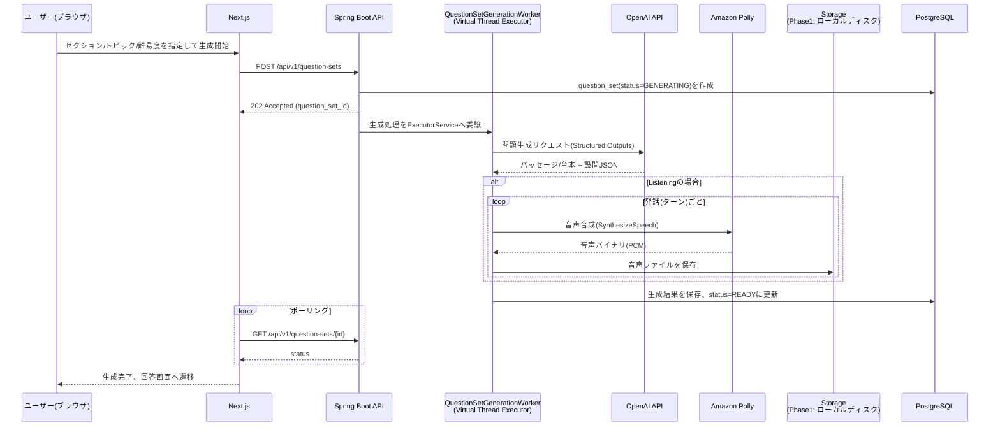

# POST /api/v1/question-sets

- 関連文書: [API一覧](../API一覧.md) / [ER図・テーブル定義](../ER図・テーブル定義.md) / [GET_question-sets-id.md](./GET_question-sets-id.md) / [GET_question-sets-id-audio-segments.md](./GET_question-sets-id-audio-segments.md)

問題セットの生成を開始する。

リクエスト:

```json
{
  "section": "READING",
  "topic": "Environment",
  "difficulty": "BAND_6_7"
}
```

- `topic`は**任意**（省略または空文字を許容）。**文字数上限は100文字**とし、超過時は`ValidationException`（400）とする
- `topic`が未入力の場合、サーバー側で以下のプリセット一覧からランダムに1件選択し、選択結果を`question_set.topic`に保存する

  ```text
  Environment, Technology, Education, Health, Travel, Culture, Science, Work
  ```

レスポンス（202 Accepted）:

```json
{
  "id": "b3f1...",
  "status": "GENERATING",
  "topic": "Environment"
}
```

- `topic`はリクエストで指定した値、または未入力時はサーバーが選択した値を即座に返す（フロントエンドが生成中インジケーターに表示するため）

## 生成フロー

Reading/Listeningともに生成には時間を要するため、**非同期生成（202 Accepted + ステータスポーリング）**で統一する。



- サーバー側でAI応答のルールバリデーションを行い、違反時は自動リトライ（1回）、それでも失敗した場合は`status=FAILED`とする
- ユーザーごとに**1日2回まで**の生成回数上限を設ける。上限超過時は`RateLimitExceededException`（429）を返す
- ゲスト（#00056）の共有デモアカウント（`app_user.is_guest=true`）に対してはこのユーザーID単位の上限を適用しない（`QuestionSetGenerationService#checkDailyLimit`）。代わりに`GuestQuotaInterceptor`がIPアドレス単位で1日`app.guest.daily-ip-limit`（既定3）回までに制限する（`guest_ip_quota`テーブル、[POST_auth-guest-token.md](./POST_auth-guest-token.md)参照）
- OpenAI/Polly連携はstub実装と実装を`app.generation.mode`（`stub`|`openai`）で切り替え可能（[実装規約.md 7章](../実装規約.md)）。全環境共通で`stub`が既定（APIコスト・外部依存なし）で、実際に接続する場合のみ`APP_GENERATION_MODE=openai`を明示する

## OpenAI API連携

- モデルは軽量モデル`gpt-4o-mini`に統一し、単価を抑える
- Structured Outputs（`response_format: json_schema, strict:true`）を用い、パース失敗のリスクを排除する
- Reading: 1回の呼び出しでパッセージ本文＋全設問グループを生成し、設問が本文根拠を持つことを保証する
- Listening: 1回目の呼び出しで台本＋設問JSONを生成する

### Structured Outputs スキーマ例（Reading・TFNG設問グループ抜粋）

```json
{
  "type": "object",
  "properties": {
    "passage": {
      "type": "object",
      "properties": {
        "title": { "type": "string" },
        "paragraphs": {
          "type": "array",
          "items": {
            "type": "object",
            "properties": {
              "id": { "type": "string" },
              "text": { "type": "string" }
            },
            "required": ["id", "text"]
          }
        }
      },
      "required": ["title", "paragraphs"]
    },
    "questionGroups": {
      "type": "array",
      "items": {
        "type": "object",
        "properties": {
          "formatType": { "enum": ["TFNG", "MCQ", "FILL_BLANK", "MATCHING_HEADINGS"] },
          "questions": { "type": "array", "items": { "type": "object" } }
        },
        "required": ["formatType", "questions"]
      }
    }
  },
  "required": ["passage", "questionGroups"]
}
```

### 生成〜永続化の処理フロー

1. `QuestionSetGenerationService`が`topic`未指定時はプリセット一覧からランダム選択した上で`question_set(status=GENERATING)`を作成し、生成処理をVirtual Thread Executor（`AsyncGenerationConfig`の`ExecutorService`）へ委譲する（`@Async`は使わない。実装規約.md 8章）
2. `QuestionSetGenerationWorker`がセクションに応じて`ReadingQuestionGenerator`または`ListeningQuestionGenerator`を呼び出す（実装は`OpenAiReadingQuestionGenerator`/`OpenAiListeningQuestionGenerator`、ローカル開発時は`StubReadingQuestionGenerator`/`StubListeningQuestionGenerator`）
3. OpenAI APIレスポンスをスキーマに従いデシリアライズ
4. サーバー側ルールバリデーション（例: `correctHeadingLabel`が`headingOptions`に存在するか、`maxWords`超過がないか）を実施
5. バリデーション失敗時は1回リトライ、それでも失敗なら`status=FAILED`、`generation_error`に理由を記録
6. 成功時は`passage`/`listening_script`/`question_group`/`question`/`answer_option`/`acceptable_answer`を保存し、Listeningの場合は`ListeningAudioSynthesizer`を呼び出してから`status=READY`に更新

## Amazon Polly連携（Listening生成時）

- 台本の発話（ターン）ごとに`SynthesizeSpeech`を呼び出し、話者ごとに異なるVoice ID（Neural Engine）を割り当てる
- 出力フォーマットは`OutputFormat.PCM`（サンプルレート16000Hz、16bit、モノラル。PollyのPCM出力は`8000`/`16000`のみサポートし`24000`は非対応のため注意）。`PollyListeningAudioSynthesizer`が受け取ったPCMバイト列に自前でWAVヘッダを付与してコンテナ化する（再生エンドポイントが`Content-Type: audio/wav`で配信するため）
- 合成した音声バイナリは**Phase1では`LocalDiskStorageService`でローカルディスクに保存する**（`StorageService`インターフェース経由）。S3署名付きURL配信への差し替えはPhase3スコープで、配信方式は[GET_question-sets-id-audio-segments.md](./GET_question-sets-id-audio-segments.md)を参照
- OpenAI/Polly呼び出しのリトライ・タイムアウト設定値は[実装規約.md 3.4章](../実装規約.md#34-外部api連携httpクライアントaws-sdk)を参照（#00033でR-3を確定）
