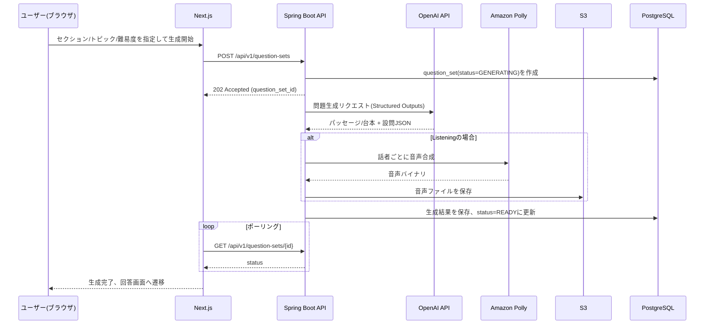

# POST /api/v1/question-sets

- 関連文書: [API一覧](../API一覧.md) / [ER図・テーブル定義](../ER図・テーブル定義.md) / [GET_question-sets-id.md](./GET_question-sets-id.md) / [GET_question-sets-id-audio-segments.md](./GET_question-sets-id-audio-segments.md)

問題セットの生成を開始する。

リクエスト:
```json
{
  "section": "READING",
  "topic": "Environment",
  "difficulty": "BAND_6_7"
}
```

レスポンス（202 Accepted）:
```json
{
  "id": "b3f1...",
  "status": "GENERATING"
}
```

## 生成フロー

Reading/Listeningともに生成には時間を要するため、**非同期生成（202 Accepted + ステータスポーリング）**で統一する。



- サーバー側でAI応答のルールバリデーションを行い、違反時は自動リトライ（最大2回）、それでも失敗した場合は`status=FAILED`とする

## OpenAI API連携

- Structured Outputs（`response_format: json_schema, strict:true`）を用い、パース失敗のリスクを排除する
- Reading: 1回の呼び出しでパッセージ本文＋全設問グループを生成し、設問が本文根拠を持つことを保証する
- Listening: 1回目の呼び出しで台本＋設問JSONを生成する

### Structured Outputs スキーマ例（Reading・TFNG設問グループ抜粋）
```json
{
  "type": "object",
  "properties": {
    "passage": {
      "type": "object",
      "properties": {
        "title": { "type": "string" },
        "paragraphs": {
          "type": "array",
          "items": {
            "type": "object",
            "properties": {
              "id": { "type": "string" },
              "text": { "type": "string" }
            },
            "required": ["id", "text"]
          }
        }
      },
      "required": ["title", "paragraphs"]
    },
    "questionGroups": {
      "type": "array",
      "items": {
        "type": "object",
        "properties": {
          "formatType": { "enum": ["TFNG", "MCQ", "FILL_BLANK", "MATCHING_HEADINGS"] },
          "questions": { "type": "array", "items": { "type": "object" } }
        },
        "required": ["formatType", "questions"]
      }
    }
  },
  "required": ["passage", "questionGroups"]
}
```

### 生成〜永続化の処理フロー
1. `QuestionSetGenerationService`が`question_set(status=GENERATING)`を作成し、非同期タスク（`@Async`）を起動
2. セクションに応じて`ReadingQuestionGenerator`または`ListeningQuestionGenerator`を呼び出す
3. OpenAI APIレスポンスをスキーマに従いデシリアライズ
4. サーバー側ルールバリデーション（例: `correctHeadingLabel`が`headingOptions`に存在するか、`maxWords`超過がないか）を実施
5. バリデーション失敗時は最大2回リトライ、それでも失敗なら`status=FAILED`、`generation_error`に理由を記録
6. 成功時は`passage`/`listening_script`/`question_group`/`question`/`answer_option`/`acceptable_answer`を保存し、Listeningの場合は`ListeningAudioSynthesizer`を呼び出してから`status=READY`に更新

## Amazon Polly連携（Listening生成時）

- 台本の発話（ターン）ごとに`SynthesizeSpeech`を呼び出し、話者ごとに異なるVoice ID（Neural Engine）を割り当てる
- 合成した音声バイナリはローカルファイルを経由せず直接S3へ保存する（保存先バケットはBlock Public Accessを有効化し非公開。配信は[GET_question-sets-id-audio-segments.md](./GET_question-sets-id-audio-segments.md)の署名付きURLで行う）
