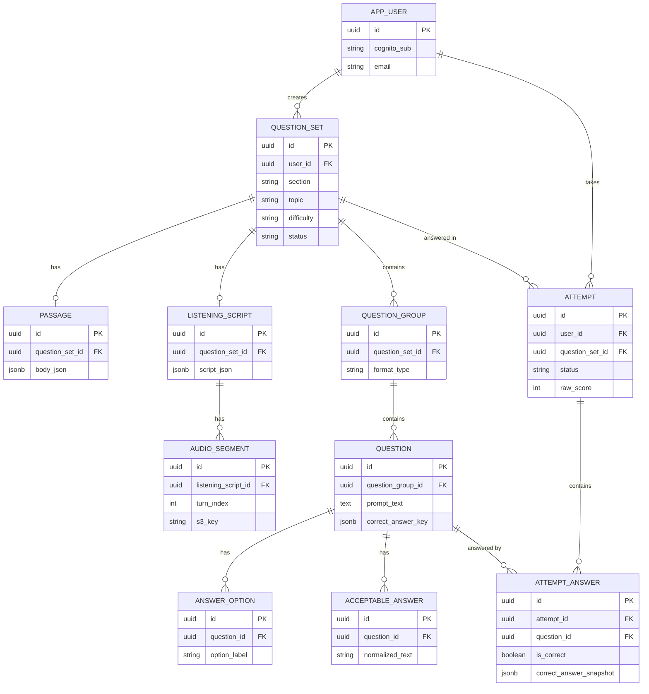

# ER図・テーブル定義

- 更新日: 2026-08-09
- 関連文書: [システム要件定義書（ielts-createrリポジトリ）8章 アーキテクチャ](https://github.com/h-fujiwara-dev/ielts-creater/blob/main/docs/システム要件定義書.md#8-アーキテクチャ) / [API一覧](./API一覧.md)

DB管理はFlywayマイグレーション（`src/main/resources/db/migration/V1__init.sql`）で行う。

## 1. ER図

## 2. テーブル一覧（概要）

| テーブル | 概要 |
|---|---|
| `app_user` | Cognitoの`sub`と紐づくアプリ内ユーザー |
| `question_set` | 1回の生成リクエスト単位。セクション/トピック/難易度/生成ステータスを保持 |
| `passage` | Reading本文（段落構造をJSONBで保持） |
| `listening_script` | Listening台本（話者・発話内容をJSONBで保持） |
| `audio_segment` | 台本の発話単位で合成した音声ファイルの所在 |
| `question_group` | 出題形式ごとの設問グループ |
| `question` | 個々の設問。正解は`correct_answer_key`(JSONB)で保持 |
| `answer_option` | MCQ・見出しマッチングの選択肢 |
| `acceptable_answer` | 穴埋め系設問の表記ゆれ許容パターン |
| `attempt` | 1回の受験セッション |
| `attempt_answer` | 受験内の設問ごとの回答・正誤・採点時点の正解スナップショット |

## 3. テーブル定義書

### 3.1 app_user
| カラム | 型 | NULL | 制約/デフォルト | 説明 |
|---|---|---|---|---|
| id | UUID | NOT NULL | PK, `gen_random_uuid()` | アプリ内ユーザーID |
| cognito_sub | VARCHAR(64) | NOT NULL | UNIQUE | CognitoのsubクレームID |
| email | VARCHAR(255) | NOT NULL | | メールアドレス |
| display_name | VARCHAR(100) | NULL | | 表示名 |
| created_at | TIMESTAMPTZ | NOT NULL | `now()` | 作成日時 |

### 3.2 question_set
| カラム | 型 | NULL | 制約/デフォルト | 説明 |
|---|---|---|---|---|
| id | UUID | NOT NULL | PK | 問題セットID |
| user_id | UUID | NOT NULL | FK → app_user.id | 生成したユーザー |
| section | VARCHAR(16) | NOT NULL | | `READING` / `LISTENING` |
| topic | VARCHAR(200) | NOT NULL | | 指定トピック |
| difficulty | VARCHAR(20) | NOT NULL | | 難易度帯 |
| status | VARCHAR(20) | NOT NULL | | `GENERATING`/`READY`/`FAILED` |
| generation_error | TEXT | NULL | | 失敗理由 |
| prompt_version | VARCHAR(20) | NOT NULL | | 生成に使用したプロンプトのバージョン |
| created_at | TIMESTAMPTZ | NOT NULL | `now()` | 作成日時 |

インデックス: `idx_question_set_user (user_id, created_at DESC)`

### 3.3 passage（Reading本文）
| カラム | 型 | NULL | 説明 |
|---|---|---|---|
| id | UUID | NOT NULL (PK) | |
| question_set_id | UUID | NOT NULL (FK) | |
| title | VARCHAR(255) | NULL | |
| body_json | JSONB | NOT NULL | `{paragraphs:[{id:"A", text:"..."}]}` |

### 3.4 listening_script（Listening台本）
| カラム | 型 | NULL | 説明 |
|---|---|---|---|
| id | UUID | NOT NULL (PK) | |
| question_set_id | UUID | NOT NULL (FK) | |
| context_text | VARCHAR(500) | NULL | 場面設定の要約 |
| script_json | JSONB | NOT NULL | `{speakers:[...], turns:[{speakerId,text}]}` |

### 3.5 audio_segment
| カラム | 型 | NULL | 説明 |
|---|---|---|---|
| id | UUID | NOT NULL (PK) | |
| listening_script_id | UUID | NOT NULL (FK) | |
| turn_index | INT | NOT NULL | 発話の順序 |
| s3_key | VARCHAR(500) | NOT NULL | 保存先キー |
| duration_ms | INT | NULL | 再生時間 |
| voice_id | VARCHAR(50) | NOT NULL | Polly Voice ID |

### 3.6 question_group
| カラム | 型 | NULL | 説明 |
|---|---|---|---|
| id | UUID | NOT NULL (PK) | |
| question_set_id | UUID | NOT NULL (FK) | |
| format_type | VARCHAR(30) | NOT NULL | `TFNG`/`MCQ`/`FILL_BLANK`/`MATCHING_HEADINGS`/`FORM_COMPLETION`/`NOTE_COMPLETION` |
| instructions | TEXT | NOT NULL | 設問グループへの指示文 |
| display_order | INT | NOT NULL | 表示順 |

### 3.7 question
| カラム | 型 | NULL | 説明 |
|---|---|---|---|
| id | UUID | NOT NULL (PK) | |
| question_group_id | UUID | NOT NULL (FK) | |
| prompt_text | TEXT | NOT NULL | 設問文 |
| display_order | INT | NOT NULL | 表示順 |
| metadata | JSONB | NULL | 例: `{paragraphRef:"B", maxWords:2}` |
| correct_answer_key | JSONB | NOT NULL | 正解（形式により構造が異なる） |
| explanation | TEXT | NULL | 解説 |

### 3.8 answer_option（MCQ・見出しマッチングの選択肢）
| カラム | 型 | NULL | 説明 |
|---|---|---|---|
| id | UUID | NOT NULL (PK) | |
| question_id | UUID | NOT NULL (FK) | |
| option_label | VARCHAR(5) | NOT NULL | 例: `A`, `i` |
| option_text | TEXT | NOT NULL | 選択肢テキスト |

### 3.9 acceptable_answer（穴埋め系の表記ゆれ許容パターン）
| カラム | 型 | NULL | 説明 |
|---|---|---|---|
| id | UUID | NOT NULL (PK) | |
| question_id | UUID | NOT NULL (FK) | |
| answer_text | VARCHAR(200) | NOT NULL | LLMが生成した許容回答 |
| normalized_text | VARCHAR(200) | NOT NULL | 正規化済みテキスト（照合用） |

### 3.10 attempt
| カラム | 型 | NULL | 説明 |
|---|---|---|---|
| id | UUID | NOT NULL (PK) | |
| user_id | UUID | NOT NULL (FK) | |
| question_set_id | UUID | NOT NULL (FK) | |
| status | VARCHAR(20) | NOT NULL | `IN_PROGRESS`/`SUBMITTED` |
| started_at | TIMESTAMPTZ | NOT NULL | `now()` |
| submitted_at | TIMESTAMPTZ | NULL | |
| raw_score | INT | NULL | 正答数 |
| max_score | INT | NULL | 総設問数 |

インデックス: `idx_attempt_user_created (user_id, submitted_at DESC)`

### 3.11 attempt_answer
| カラム | 型 | NULL | 説明 |
|---|---|---|---|
| id | UUID | NOT NULL (PK) | |
| attempt_id | UUID | NOT NULL (FK) | |
| question_id | UUID | NOT NULL (FK) | |
| user_answer_text | TEXT | NULL | ユーザーの回答 |
| is_correct | BOOLEAN | NULL | 採点結果 |
| correct_answer_snapshot | JSONB | NOT NULL | 採点時点の正解（不変記録） |
